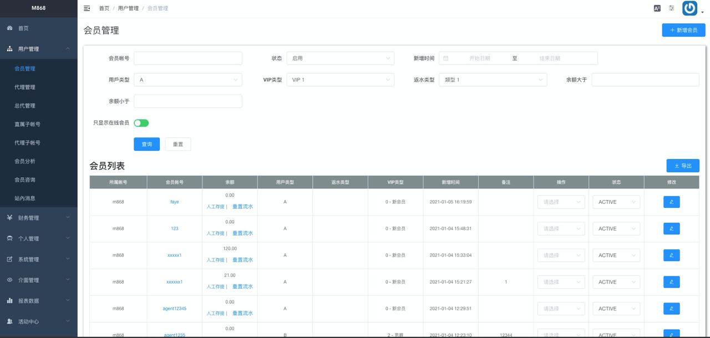

### 中文介绍
请查看 [README.md](https://github.com/jonyig/Resume/blob/main/README.md)

# Jonny Kuo

- Birthday: 1994/12/26
- Education: Ming Chuan University / Bachelor of Information Management 
- Location: Taiwan, Taipei
- E-mail: ji394su311203106@gmail.com
- Mobile: 0975-965-966
- tech note : https://blog.jonny.website

## Profile
  - Life and work need to be on both sides of Libra。
  - I love camping and going mountain when I get the bug。
  - Dream to make good life for worldwide by my skill on software development。
   

## Skill

### HTML/CSS
* Use Tailwind to develop RWD fastly。
* Use Sass planning construct of Web layout。
* Use construct of BEM & OOCSS。

### Javascript/Framework
* Use VueJS 、 ReactJs。

### PHP/MySqL
* Plan the construct by DI，and separate the logic layer and DB layer。
* Dev the Back-end stand by S.O.L.I.D。
* Framework / Laravel。
* Use Satis to separate other logic。
* Like Unit Test to check Api is good。

### Git/GitHub
* Do CI-CD by Action。

### Other
* Compile Docker-compose file for team。
* Server de-bug by Nginx Log。
* Use AWS、GCP。
* Mac OSX。

## Experience
- During： 2020/05 - 2020/12 | @GSM  
    Position: full-stack develop  
    * Use Laravel to develop RESTful-api and CRM system
    * Develop game module by Fly-system
    * User VueJS to develop the website
    * Publish work flow 
    * Plan API Test Case

- During： 2018/04 - 2019/09 | @Shop123  
    Position: PHP develop  
    * Easy open a shop on website 
    * Plan ERP construct 
    * Use Taiwan E-invoice to create new business
    * User Docker-compose for dev environment

### Works
 #### Covid-19 Global Dashboard
 - https://covid19tw.tk/
 
   ⌞ Use NextJS。 
   ⌞ Get Number of confirmed cases by api。 
   ⌞ Get covid-19 news by Api。 

 #### Weather  
 - https://jonyig.github.io/realtime-weather-app/
 
    ⌞ Use ReactJS。 
    ⌞ Get weather data by Api in Taiwan。 
    
 #### GSM CRM System
  
 
   ⌞ Use VueJS + ElementUI。 
   ⌞ Change language by I18N + Vuex 。 
   ⌞ Use Tailwind assisting ElementUI 。 
 
 
