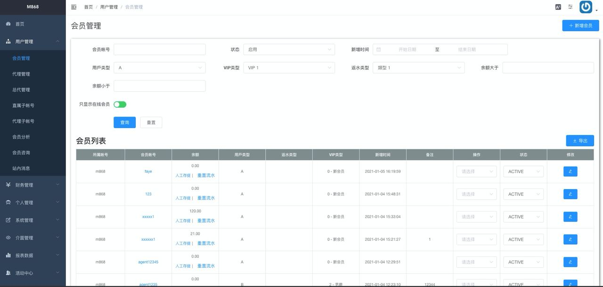

### English introduction
Please view [README-EN.md](https://github.com/jonyig/Resume/blob/main/README-EN.md)

# 郭仲益 (Jonny Kuo)

- Birthday: 1994/12/26
- Education:銘傳大學 / 資訊管理
- Location: New Taipei City
- E-mail: ji394su311203106@gmail.com
- Mobile: 0975-965-966
- 線上技術及心得筆記本 : https://blog.jonny.website

## 自我介紹
  - 生活與工作需要為天秤的兩邊。
  - 常常在旅行中尋找自我與沈澱心靈，當程式碼卡住我了，我就上山露營，放鬆我的心靈。
  - 夢想著可以利用設計出來的軟體改變人們的生活，讓世界更好一點點。
   

## 技能

### HTML/CSS
* 使用 Tailwind 快速開發 RWD。
* 使用 Sass 規劃 Web layout 架構。
* 利用 BEM & OOCSS 架構。

### Javascript/Framework
* 用 VueJS 、 ReactJs 開發畫面。

### PHP/MySqL
* 規劃程式架構，善用DI，並將邏輯與資料庫溝通分開。
* 堅守 S.O.L.I.D 完成後端開發。
* Framework 使用 Laravel。
* 善用 Satis 將其他邏輯分開。
* 撰寫 Unit Test 確保 Api 正確性。

### Git/GitHub
* 使用 Action 進行 CI-CD。

### 其他
* 編寫 Docker-compose 確保團隊開發環境一致。
* Nginx 調整觀察 Log 除錯。
* 操作 AWS、GCP。
* Mac OSX。

## 工作經歷
- 工作期間： 2020/05 - 2020/12 | @GSM  
    職位: 全端工程師  
    * 使用 Laravel Framework 開發後端 RESTful API 與 CRM 管理頁面
    * 使用 Fly System 開發遊戲串接模組
    * 利用 VueJS + ElementUI 開發包網平台
    * 建立團隊組織內的工作流
    * 規劃架構 API Test Case

- 工作期間： 2018/04 - 2019/09 | @Shop123  
    職位: PHP 工程師  
    * 開店系統平台功能維護與規劃
    * 客戶 ERP 系統架構規劃
    * 開發新發票加值系統規劃，利用已有發票加值商身份，開創公司新業務
    * 導入 Docker 至開發環境

### 作品
 #### 新冠病毒每日確診追蹤與相關新聞整理 
 - https://covid19tw.tk/
 
   ⌞ 使用 NextJS 開發 。 
   ⌞ 串接國外整理病毒 Api 。 
   ⌞ 串接新聞 Api 。 

 #### 天氣選擇器 
 - https://jonyig.github.io/realtime-weather-app/
 
    ⌞ 使用 ReactJS 開發 。 
    ⌞ 串接天氣預報 Api 。 
    
 #### 公司專案
 - 後台系統
 
    
   
    ⌞ 使用 VueJS + ElementUI 開發 。 
    ⌞ 使用 使用內部 I18N + Vuex 快速切換語言 。 
    ⌞ 使用 Tailwind 輔助 ElementUI 。 
 
 
